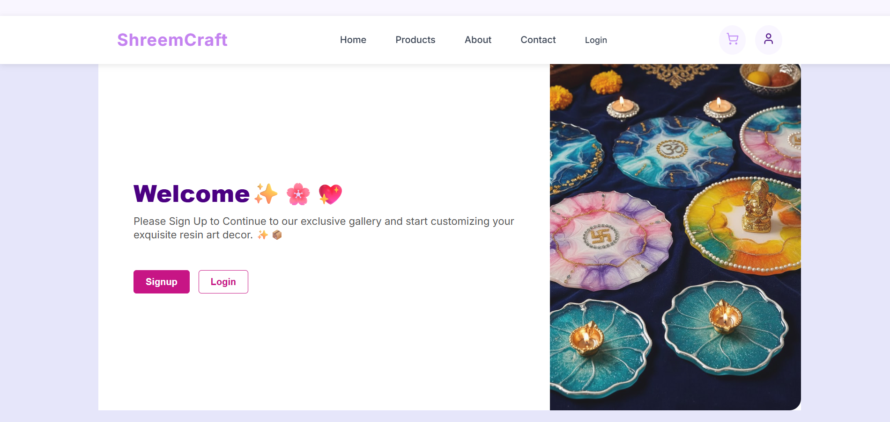
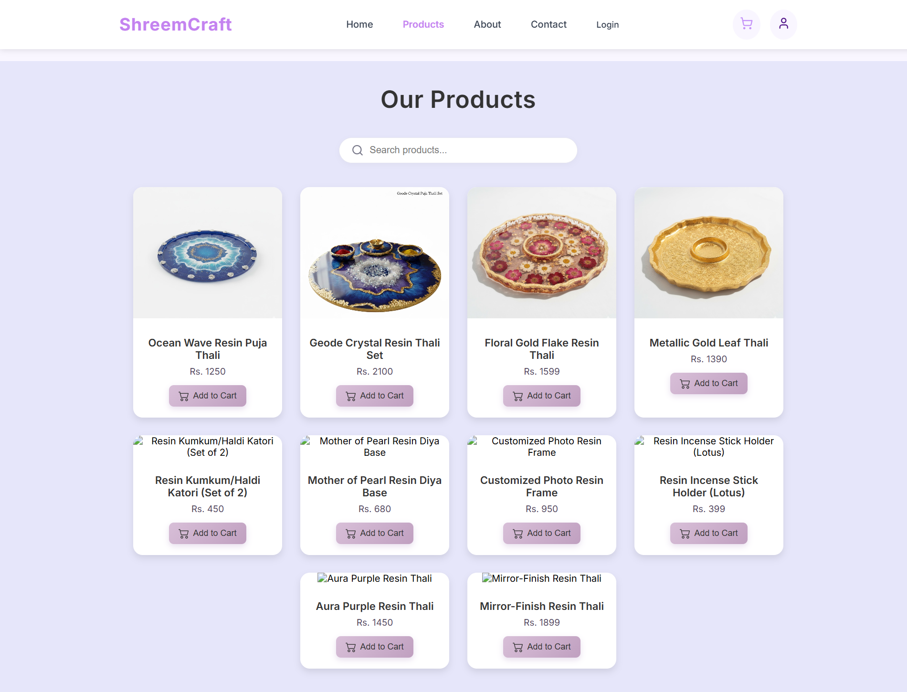
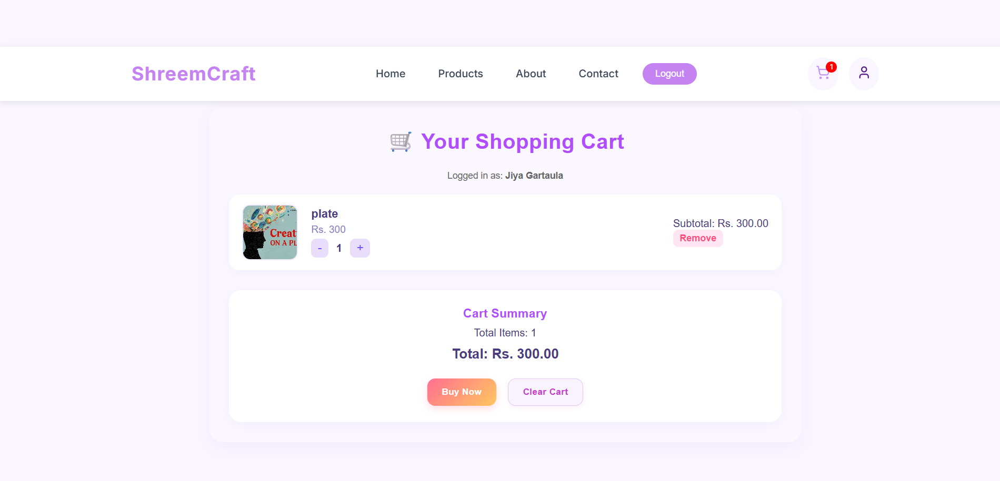
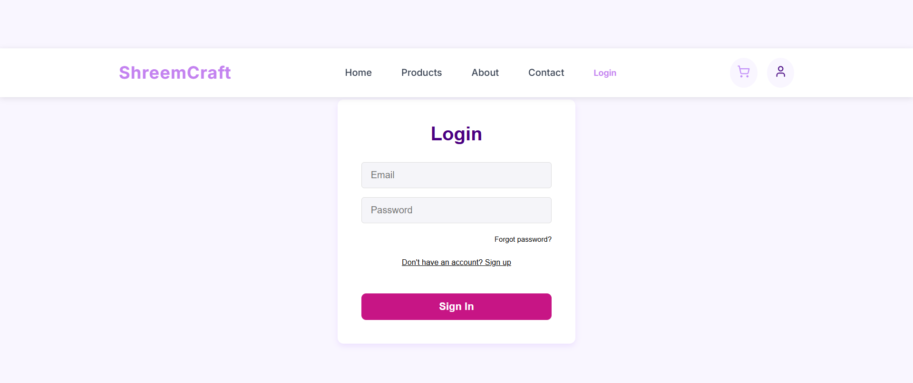
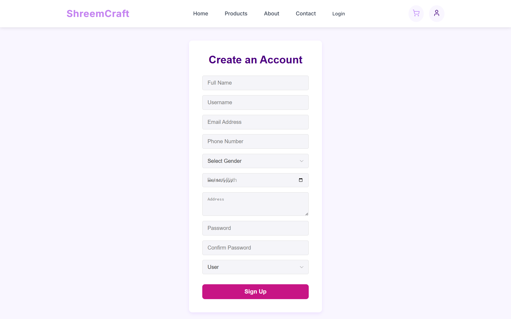
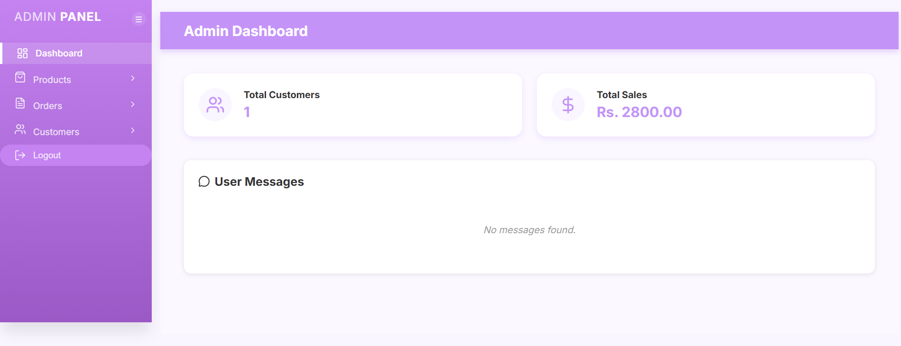
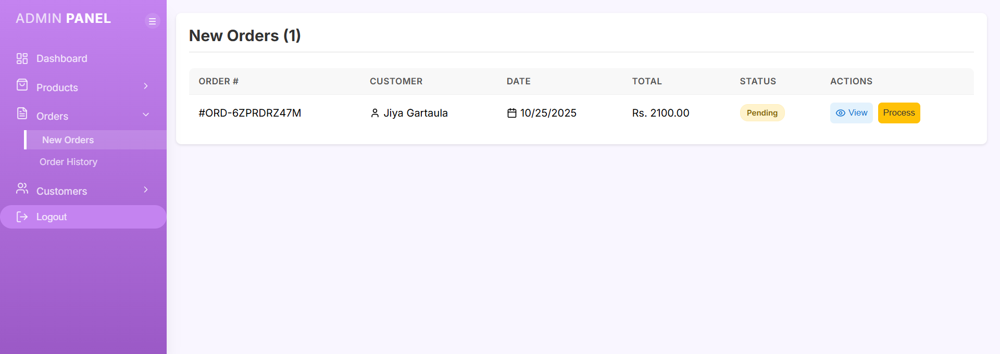
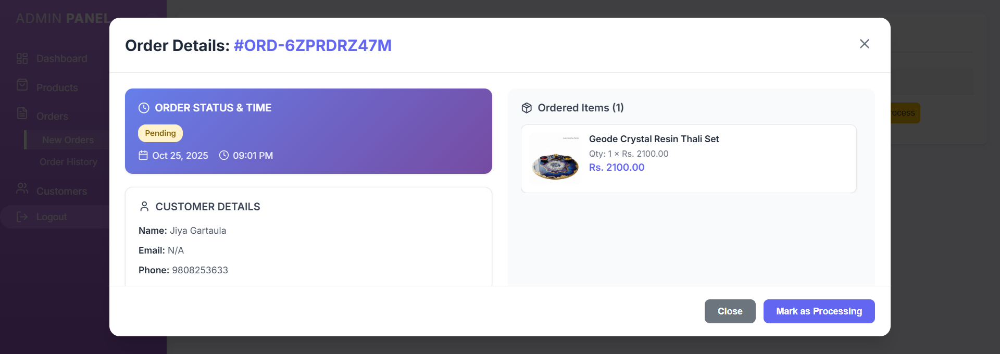

# 🧾 Sales Management System

A full-stack Sales Management System built using **Laravel (backend)** and **React (frontend)**.  
This system helps manage sales, products, customers, and reports efficiently with a modern user interface.

---

## 🚀 Features

### 👨‍💼 Admin Features
- Add, update, delete products
- Manage users
- Approve orders

### 🧍‍♂️ User Features
- Register and login
- View and purchase products
- Manage profile
- View order history

---
## ⚙️ Setup Instructions

Follow these steps to set up and run the project locally:


### 🔹 1. Clone the Repository
```bash
git clone https://github.com/utshathapa/Sales-management-system.git
cd Sales-management-system
```
###🔹 2. Backend Setup (Laravel)
```bash
cd backend
cp .env.sample .env
composer install
php artisan key:generate
php artisan migrate
```
###🔹 3. Frontend Setup (React)
```bash
cd frontend
npm install
```
###🔹 4. Run the project
```bash
cd  Sales-management-system
npm run dev
```
### 🧠 Tech Stack
Frontend: React, Vite, Axios, Tailwind CSS
Backend: Laravel, PHP, MySQL
Tools: Composer, Node.js, Git, VS Code, Postman

## 📸 Screenshots

### User Interface
- **Landing Page**  
  

- **Home Page**  
  

- **Products**  
  

- **Shopping Cart**  
  

- **Login**  
  

- **Sign Up**  
  

### Admin Panel
- **Dashboard**  
  

- **Customer Management**  
  

- **Add Product**  
  

- **Order Management**  
  
  

